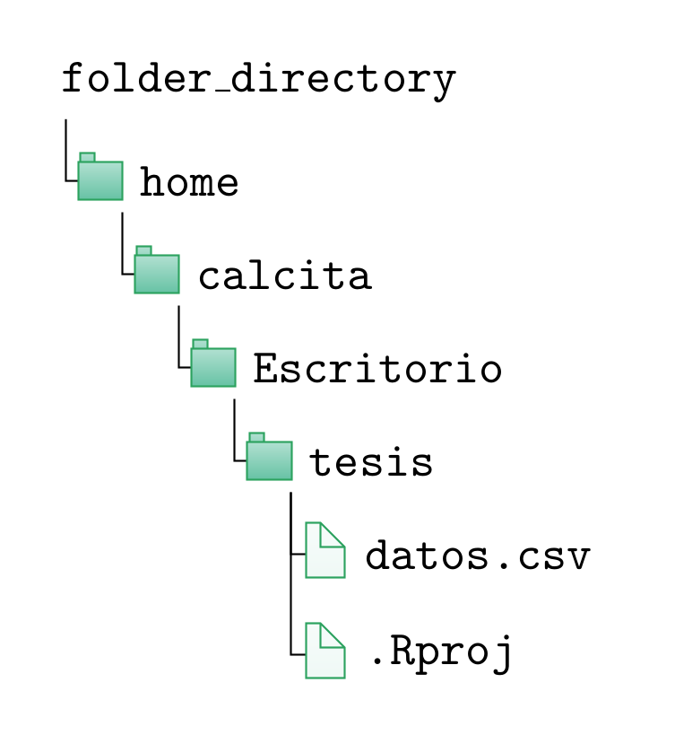

```{r, include = F}
knitr::opts_chunk$set(fig.width = 6, message = FALSE, warning = FALSE, comment = "", cache = FALSE, fig.retina = 3)
library(flipbookr)
library(tidyverse)
library(flair)
library(kableExtra)
```
```{r xaringan-themer, include=FALSE, warning=FALSE}
library(xaringanthemer)
style_duo_accent(
  #base_color = "#43a2ca",
  header_font_google = google_font("Mukta"),#Ubuntu Condensed
  text_font_google   = google_font("Montserrat", "300", "300i"),
  code_font_google   = google_font("Fira Mono"),
  primary_color      = "#0F4C81", # pantone classic blue
  secondary_color    = "#b3e2cd", # pantone baby blue
  #header_font_google = google_font("Raleway"),
  #text_font_google   = google_font("Raleway", "300", "300i"),
  #code_font_google   = google_font("Source Code Pro"),
  text_font_size     = "25px"
#   colors = c(
#   red = "#f34213",
#   purple = "#3e2f5b",
#   orange = "#ff8811",
#   green = "#136f63",
#   white = "#FFFFFF",
# )
)

```

```{r, include=FALSE}
text_spec2 <- function(x = "x"){
  text_spec(x, background = "#b3e2cd", bold = T)
}
```

# ¿Qué haremos hoy?

- Exportar objetos a archivos RData. Importar archivos RData.
<br><br>
--

- Definir una función para encontrar un dato faltante
<br><br>
--

- Definir una función para encontrar un caso duplicado
<br><br>
--

- Introducción al paquete dplyr para manipular un data frame
<br><br>
--

- Operadores lógicos y de comparación. Operador %in%.
<br><br>
--

- Trabajar en proyecto (.Rproj)

---
class: inverse, center, middle
# RData

---
# Guardar un objeto a un archivo RData

- `r text_spec2("RData")` es un formato propio de R.
<br><br>
--

- Sirve para `r text_spec2("guardar objetos de R")`. Los archivos ocupan mucho menos espacio que otros formatos.
<br><br>
--


---
# Guardar un objeto a un archivo RData

La función `r text_spec2("save()")` permite guardar un `r text_spec2("objeto")` en un `r text_spec2("archivo RData")`

```{r eval=FALSE}
# guardar un objeto (data frame) en formato R
save(ech19, file = "data/ech19.RData")
```
--

- Debo escribir el argumento `r text_spec2("file")` de lo contrario me dará error porque no es el segundo argumento de la función. Allí especifico el nombre del archivo que voy a crear. 

- Adicionalmente puede incluir la ruta donde se creará el archivo. Si solo se define el nombre del archivo, se guarda en el directorio de trabajo actual: **getwd()**
<br><br>
--

- El `r text_spec2("nombre")` del objeto y el archivo pueden coincidir, pero no necesariamente.
<br><br>
--

- Es posible guardar más de un objeto en el mismo archivo RData. 

---
# Leer un archivo RData

- La función `r text_spec2("load()")` permite cargar archivos RData.
<br><br>
--

- `r text_spec2("No lo asigno a ningún objeto")` a diferencia del resto de las funciones de importación/lectura.
<br><br>
--

```{r  eval=FALSE}
load("data/ech19.RData")
```

- En este caso puedo prescindir de nombrar el argumento file porque es el primero de la función.


---
# Leer un archivo RData

¿Qué pasa si lo asigno a un objeto?
<br><br>


- Si existe como archivo RData tuvo que crearse primero como objeto.
<br><br>

---
# Leo los datos de ECH 2019

Es una nueva sesión así que no tengo los objetos en memoria que tenía ayer.

Voy a usar la función `r text_spec2("load()")` que viene en R-base.

```{r echo = FALSE}
load("data/ech19.RData") #cargo los datos
```

```{r eval = FALSE}
load("/home/calcita/Desktop/ech19.RData") #cargo los datos
```
Nunca asigno a un objeto cuando uso la función load()

---
# Datos faltantes (NA)

- La función `r text_spec2("is.na()")` chequea si hay un dato faltante (`r text_spec2("NA: not available")`) para cada elemento de un vector. 
<br><br>
--


```{r}
x <- c(-22, 4, -1, 8, NA) #<<
x
```
- ¿Cuántos datos faltantes tiene x?
--

- Devuelve un `r text_spec2("vector lógico")`, donde el TRUE indica que no hay dato y el FALSE que sí hay dato.

```{r}
is.na(x) #<<
```
---
# Ejemplo: Datos faltantes (NA)

```{r echo = FALSE}
ech19 <- ech19 %>% select(numero, nper, dpto, nomdpto, region_3, e26, e27, ht19, pobpcoac)
```

```{r eval = TRUE}
sin_pobpcoac <- is.na(ech19$pobpcoac)
```
--

- ¿Cuántos son los valores faltantes de  `pobpcoac`?

```{r eval = TRUE}
table(sin_pobpcoac) 
sum(sin_pobpcoac) #<<
```

El valor lógico `r text_spec2("TRUE")` representa al `r text_spec2("1")` y el valor `r text_spec2("FALSE")` representa al `r text_spec2("0")` por eso puedo usar la función `r text_spec2("sum()")`. 

---
# Observaciones duplicadas

La función `r text_spec2("duplicated()")` determina cuales elementos de un vector o data frame están duplicados, devuelve un vector lógico: TRUE si es duplicado y FALSE en caso contrario.
<br><br>
--

- `r text_spec2("Compara un elemento del vector con todos los anteriores")`, va asignando el valor FALSE hasta que se encuentra con un caso duplicado y en este caso le asigna TRUE y sigue comparando. 


```{r}
x <- c(-22, 4, 8, 8, NA) #<<
x
```
--
```{r}
duplicated(x) #<<
```

---
# Ejemplo: observaciones duplicadas


- Chequeo que haya algún `r text_spec2("caso duplicado")`, reviso todas las variables
```{r eval =  TRUE}
repetidos <- duplicated(ech19) # el argumento es el data frame #<<
sum(repetidos) # los sumo, recordar: TRUE es 1 y FALSE es 0 #<<
```

- Chequeo que haya algún `r text_spec2("valor duplicado")`  en la `r text_spec2("variable identificatoria de cada caso")`

```{r eval = TRUE}
repetidos <- duplicated(ech19$numero) # el argumento es una variable #<<
sum(repetidos) #<<
```

Si nombro a un objeto igual a uno existente, lo sobreescribo.

---
class: inverse, center, middle
# dplyr

---
# Manipular datos con dplyr
```{r setup, include = FALSE}
options(htmltools.dir.version = FALSE)
knitr::opts_chunk$set(warning = FALSE, message = FALSE)
library(dplyr)
```

- El paquete dplyr permite representar la información de un `r text_spec2("data frame")` en forma de `r text_spec2("tabla")`, donde cada fila representa una observación y cada columna represente una variable.
<br><br>
--

- dplyr no provee ninguna funcionalidad que no pueda ser realizada con las funciones del paquete base, sin embargo, es más simple y rápido (está escrito en C++).
<br><br>
--

- Todas las funciones del paquete tiene la particularidad de que su  `r text_spec2("primer argumento es un data frame")` al que le realizará la operación, mientras que los subsiguiente argumentos describen como realizar tal operación. 

- Finalmente el `r text_spec2("resultado")` de todas estas funciones es un nuevo `r text_spec2("data frame")`. Esto no ocurre con las funciones de base. 

---
class: center, middle
# ~~Base R vs. Tidyverse~~


---
# Instalar y cargar dplyr

- La instalación es por única vez en una computadora. 
```{r eval=FALSE}
# install.packages("dplyr") # ya lo tengo instalado
```
- Comenté esa línea porque ya lo tengo instalado
--

- En cada nueva sesión de RStudio lo debo cargar para poder usar sus funciones

```{r}
library(dplyr) #<<
```

Notar que en la función de instalación el nombre del paquete se escribe entre comillas pero en la función de carga va sin comillas. No hagas ~~library("dplyr")~~.


---
# Manipular datos

- Seleccionar columnas/variables
<br><br>
--

- Cambiar nombre de variables
<br><br>
--

- Transformar variables
<br><br>
--

- Crear nuevas variables
<br><br>
--

- Filtrar o eliminar observaciones
<br><br>
--

- Chequear existencia de observaciones duplicadas
<br><br>
--

- Chequear existencia de datos faltantes
<br><br>
--

- Reestructurar los datos

---
class: inverse, center, middle
# dplyr::select()

---
# Seleccionar columnas/variables 

- La función `r text_spec2("select()")`  selecciona columnas de un data frame
--

- El primer argumento es el data frame y luego la(s) variable(s) separadas por coma.
--

- `select`(`r text_spec2("<dataframe>")`, `r text_spec2("<variable>")`) 
<br><br>
--

.pull-left[
```{r eval =  TRUE}
select(ech19, numero) #<<
```
]
.pull-rigth[

```{r eval =  TRUE}
select(ech19, numero, nper) #<<
```
]

Las funciones de tidyverse permiten llamar a las variables de un data frame sin usar comillas pero esto no es aplicable al resto de los paquetes de R, incluido los del base.

---
# Seleccionar columnas/variables 

.pull-left[
Seleccionar un rango de columnas: select(`r text_spec2("<df>")`, `r text_spec2("<desde>:<hasta>")`)

```{r eval =  FALSE}
select(ech19, dpto:region_3)
```

]
.pull-right[
Seleccionar todas las columnas menos una: select(`r text_spec2("<df>")`, `r text_spec2("-<variable>")`)


```{r eval =  FALSE}
select(ech19, -nper)
```

]

---
class: inverse, center, middle
# dplyr::slice()

---
# Seleccionar filas/observaciones por su posición

- La función `r text_spec2("slice()")` selecciona observaciones/filas según su posición. 
--

- Esto no es robusto a un reordenamiento de las observaciones. Sirve para "ver" algunos casos.
--

- `slice`(`r text_spec2("<df>")`, `r text_spec2("<nro_variable>")`, `r text_spec2("<nro_variable>")`)
<br><br>
--

.pull-left[
```{r eval =  FALSE}
# selecciono las filas 1 y 5
slice(ech19, 1, 5) #<<
```
]


.pull-right[
```{r eval =  FALSE}
# selecciono las filas de 1 a 5
slice(ech19, 1:5) #<<
```

]


---
class: inverse, center, middle
# dplyr::filter()

---
# Selecciona observaciones según condición

- La función `r text_spec2("filter()")` selecciona observaciones/filas según una condición.
--

- Puede ser una condición que involucre a una o varias variables. Condiciono a que tome o no tome ciertos valores.
--

- `filter`(`r text_spec2("<df>")`, `r text_spec2("<condicion>")`)
<br><br>
--
```{r eval = TRUE}
mdeo <- filter(ech19, dpto == 1) # me quedo con los casos de Montevideo #<< 
head(mdeo)
```

---
class: inverse, center, middle
# Operadores comparativos

---
# Operadores de comparación 

.pull-left[
Mayor que: `r text_spec2(">")`

```{r eval = FALSE}
filter(ech19, e27 > 90) # personas mayores de 90 #<<
```

]
.pull-rigth[
Mayor igual que: `r text_spec2(">=")`

```{r eval = FALSE}
filter(ech19, e27 >= 90)  # personas mayores de 90 o mas  #<<
```

]

---
# Operadores de comparación 

.pull-left[
Menor que: `r text_spec2("<")`

```{r eval = FALSE}
filter(ech19, e27 < 10) #<<
```

]
.pull-rigth[

Menor igual que: `r text_spec2("<=")`

```{r eval = FALSE}
filter(ech19, e27 <= 10) #<<
```

]

---
# Operadores de comparación 

.pull-left[
Igual que: `r text_spec2("==")`

```{r eval = FALSE}
filter(ech19, e27 == 90) #<<
```

]
.pull-rigth[

Diferente que: `r text_spec2("!=")`

```{r eval = FALSE}
filter(ech19, e27 != 90) #<<
```

]

---
class: inverse, center, middle
# Operadores lógicos

---
# Operadores lógicos

O lógico:  `r text_spec2("|")`

```{r eval = FALSE}
# selecciono personas menores a 10 o mayores a 90
filter(ech19, e27 < 10 | e27 > 90) #<<
```


---
# Operadores lógicos

Y lógico:  `r text_spec2("&")` 

```{r eval = FALSE}
# selecciono menores a 10 y de Salto
filter(ech19, e27 < 10 &  nomdpto == "FLORES") #<<
```
--

---
# Operadores lógicos

No lógico: `r text_spec2("!")`

```{r eval = FALSE}
# selecciono todas las personas que no tienen 90 
filter(ech19, !e27 == 90) #<<
```

---
class: inverse, center, middle
# %in%

---
# Operador %in%

- `r text_spec2("Compara cada elemento")` de un vector con los elementos de otro vector.
--

- `r text_spec2("<x> %in% <y>")`, el primer elemento de x se compara con todos los elementos de y, el segundo elemento de x se compara con todos los elementos de y, así sucesivamente. 
--

- Devuelve un TRUE o un FALSE en cada comparación. TRUE cuando el elemento de x está en y, FALSE en caso contrario.
--

- Cuando lo uso `r text_spec2("en filter() se queda con los TRUE")`. 

```{r eval = FALSE}
# selecciono personas Durazno y Rocha
filter(ech19, nomdpto %in% c("DURAZNO", "ROCHA"))
```

En este caso es lo mismo que:
```{r eval = FALSE}
# selecciono alojamientos menor a 60 y que el tipo sea Private room 
filter(ech19, nomdpto == "DURAZNO" | nomdpto == "ROCHA")
```
---
# Ejercicio (10')

- Selecciona los casos que tienen entre 3 y 5 años de edad y guarda en un objeto llamado `menores_3_5`. La variable e27 es la edad.
<!-- review_10_20 <- filter(ech19, number_of_reviews >= 10 & number_of_reviews <= 20) -->

- Selecciona los casos cuya vivienda tiene 4 o 6 habitaciones y guarda en un objeto llamado `habitaciones_4`. La variable d9 es el número de habitaciones.

<!-- availability_3_5 <- filter(ech19, availability_365 %in% c(3,5)) -->
<!-- availability_3_5 <- filter(ech19, availability_365 == 3 | availability_365 == 5) -->

- Selecciona los últimos 5 casos de ech19 y guarda en un objeto llamado `ultimos_5`.
<!-- last_5 <- slice(ech19, (nrow(ech19)-4):nrow(ech19)) -->
 <!-- last_5 <- slice_tail(ech19, n = 5) -->
 
<!-- - Selecciona las variables referidas a reviews y guarda en un objeto llamado `reviews_name`.  -->
<!-- reviews_name <- ech19 %>% select(contains("review")) -->

- Selecciona un registro por hogar y guarda en un objeto llamado `hogares`. 
 <!-- hogares <- filter(ech19, nper == 1) -->
 
- ¿De cuál departamento es el hogar con mayor cantidad de personas? Ver ?slice_max
<!-- select(slice_max(hogares, ht19), nomdpto)  -->

---
class: inverse, center, middle
# dplyr::arrange()

---
# Ordenar las observaciones según una variable

```{r eval = FALSE}
ech19 <- select(ech19, ht11, numero, nomdpto)
```

La función `r text_spec2("arrange()")` `r text_spec2("ordena")` un data frame de acuerdo a una(s) variable(s) de manera `r text_spec2("creciente")` por defecto.
--

```{r eval=FALSE}
arrange(ech19, ht11) #<<
```
--

Para ordenar de manera `r text_spec2("decreciente")` debo incluir la función `r text_spec2("desc()")`:
```{r eval=FALSE}
arrange(ech19, desc(ht11)) #<<
```
--
Para ordenar por más de una variable:
```{r eval=FALSE}
arrange(ech19, desc(ht11), e27)
```

---
class: inverse, center, middle
# dplyr::summarise()

---
# Calcular un resumen de una variable

- La función `r text_spec2("summarise()")` o `r text_spec2("summarize()")` calcula un resumen de variables

- summarise(`r text_spec2("<df>")`, `r text_spec2("<column>")` = `r text_spec2("<function>")`(`r text_spec2("<variable>")`))

- El resultado será una data frame con una fila, a menos que los datos estén agrupados, y una columna por cada estadístico de resumen.

```{r eval = FALSE}
summarise(ech19, promedio = mean(ht19)) #<<
```

- Se puede utilizar cualquier función que cumpla con que lo datos de entrada sean numéricos y como salida se entregue una constante. Por ejemplo las funciones de resumen que vimos de R base: `mean`(), `max`(), `min`(), `median`(), `var`(), `sd`(), `sum`(), etc. Existen otras específicas de `dplyr` que iremos viendo.

---
# Calcular un resumen de una variable

- Se pueden aplicar diferentes funciones a la misma o diferentes variables

```{r eval =FALSE}
# la función n() devuelve la cantidad de observaciones
summarise(ech19, promedio = mean(ht19), varianza = var(ht19), total = n()) #<<
```

- Suele ser más claro escribirlo hacia abajo

```{r, eval = FALSE}
summarise(ech19, promedio = mean(ht19), #<<
                 varianza = var(ht19), #<<
                 total = n()) #<<
```

---
class: inverse, center, middle
# dplyr::count()

---
# Cálculo frecuencias de una variable

- La función `r text_spec2("count()")` es la función de dplyr para hacer una tabla de frecuencias, el resultado es siempre un data frame de menor dimensión que el original.
--

- count(`r text_spec2("<df>")`, `r text_spec2("<variable>")`)
--

- En R base usamos `r text_spec2("table()")` pero el resultado no es un data frame y la salida no es muy amigable.
--

--

```{r}
count(ech19,  region_3) #<<
```


---
# Cálculo frecuencias entre dos variables


```{r}
count(ech19, region_3, e26) #<<
```


---
class: inverse, center, middle
# dplyr::mutate()

---
# Calculo una nueva variable 

- La función `r text_spec2("mutate()")` permite calcular nuevas variables
--

- mutate(`r text_spec2("<df>")`, `r text_spec2("<nombre>")` = `r text_spec2("<calculo>")`)
--

- El resultado será de la `r text_spec2("misma cantidad de observaciones")` que el data frame original
--

- Conviene guardarlo en el mismo objeto  (data frame original)
--

```{r eval = TRUE}
ech19 <- mutate(ech19, media_edad = mean(e27)) #<<
head(ech19$media_edad)
```

---
class: inverse, center, middle
# dplyr::case_when()

---
# Crear una variable a partir de varias condiciones

La función `r text_spec2("case_when()")` permite calcular una nueva variable a partir de condicionar los valores de otra

```{r}
ech19 <- mutate(ech19,
  mayor = case_when( #<<
    e27 < 18 ~ "Menor", #<<
    e27 >= 18 ~ "Mayor")) #<<
```

---
# Agrupo los casos por cierta variable

```{r echo = FALSE}
```

- La función `r text_spec2("group_by()")` permite agrupar las observaciones por cierta variable.
--

- Permite hacer operaciones por grupos para posteriormente realizar otros cálculos.
--

- group_by(`r text_spec2("<df>")`, `r text_spec2("<variable>")`)
--

```{r}
# promedio de precio por barrio
ech19_gr <- group_by(ech19, nomdpto) #<<
summarise(ech19_gr, promedio = mean(ht19)) #<<
```
---
# Agrupo los casos por cierta variable

- También lo puedo hacer concatenando funciones

```{r}
summarise(group_by(ech19, nomdpto), promedio = mean(ht19)) #<<
```
--
- En la línea anterior anidamos funciones para obtener el promedio según barrios.
- La anidación de funciones tiende a volver confuso el código...veremos luego cómo superar este inconveniente con el operador `%>%`.

---
# Ejercicio (5')

- Calcular el promedio de edad según sexo.

- Calcular la cantidad de jefas de hogar.

---
# Trabajar en proyecto

.pull-left[

Permite ordenar los diferentes archivos de un análisis y prescindir de usar setwd() y/o escribir rutas larguísimas. 

Si el archivo `tesis.Rproj` está ubicado en: `/home/calcita/Escritorio/tesis`, todos los archivos que estén en la carpeta tesis voy a poder cargarlos sin definir una ruta del archivo. 

```{r eval=FALSE}
load("datos.csv")
```

]

.pull-right[
```{r echo = FALSE}

```

]

---
# Crear proyecto

{height = 80%}

---
# Abrir proyecto


---
# Crear script


---
# Ejercicio (5')

.left-column[
```{r out.width = "80px" ,echo=FALSE}
knitr::include_graphics("https://raw.githubusercontent.com/calcita/Curso-rECH/master/images/folder.png")
```
<br><br>
```{r out.width = "80px" ,echo=FALSE}
knitr::include_graphics("https://raw.githubusercontent.com/calcita/Curso-rECH/master/images/zipper-tool.png")
```
<br><br>
```{r out.width = "80px" ,echo=FALSE}
knitr::include_graphics("https://raw.githubusercontent.com/calcita/Curso-rECH/master/images/rproj.png")
```
<br><br>
```{r out.width = "80px" ,echo=FALSE}
knitr::include_graphics("https://raw.githubusercontent.com/calcita/Curso-rECH/master/images/web-programming.png")
```

]

.rigth-column[
<br><br>
Crear una carpeta llamada "Curso ECH"

<br>

<!-- Descomprimir allí los archivos de la ECH 2018 y llamar "data" a la carpeta que contiene los archivos -->

<br>

Abrir Rstudio y crear un proyecto. Observa dónde se creó el ícono .Rproj

<br><br>
Crear un script de R donde guardaremos el código de este taller


]


